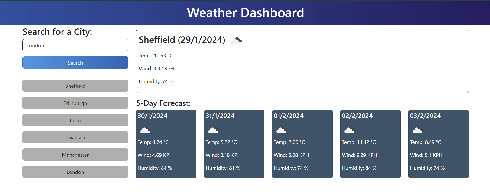

# Weather-Dashboard

---

## Description

Welcome to the Weather Dashboard project! This web application is designed to provide users with a convenient way to check the weather outlook for multiple cities. The dashboard dynamically updates HTML and CSS to display current and future weather conditions. Users can also access a 5-day forecast for the selected city.

## Project Overview

Server APIs allow developers to access data and functionality by making requests with specific parameters to a URL. This Weather Dashboard leverages the OpenWeatherMap APIs to retrieve weather data for cities, presenting it in an easy-to-read format for users.

### Features

* User-friendly interface with form inputs for city searches.
* Display of current weather conditions, including city name, date, weather icon, temperature, humidity, and wind speed.
* 5-day forecast showcasing date, weather icon, temperature, humidity, and wind speed.
* Search history functionality to quickly access weather details for previously searched cities.

The following image shows the web application's appearance and functionality:

### How to Use

To check forecast open the [Weather-Dashboard](https://natves.github.io/Weather-Dashboard/) in a web browser. Enter the name of the city you want to check the weather for in the search bar and view the current weather conditions and 5-day forecast for the selected city. Explore the search history to easily revisit weather details for previous cities.

## Technologies Used

* HTML
* CSS
* JavaScript
* jQuery
* Day.js
* OpenWeatherMap APIs

## Credits

I'd like to acknowledge [W3Schools](https://www.w3schools.com) and [MDN Web Docs](https://developer.mozilla.org/en-US/) for creating invaluable resources. Also, I want to mention the [Stackoverflow website](https://stackoverflow.com/) where I found new interesting ideas for this project.

## License

Please refer to the LICENSE in the repo.